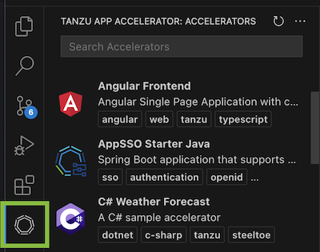
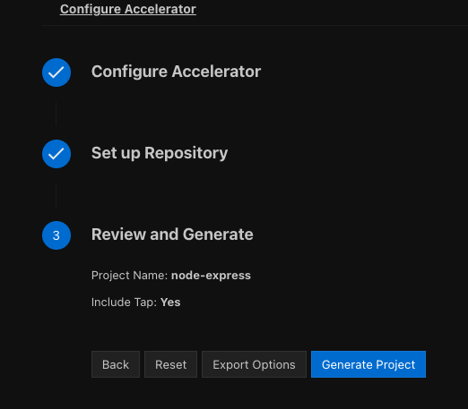

# Use the Application Accelerator Visual Studio Code extension

This topic describes how to use the Application Accelerator Visual Studio Code extension to explore
and generate projects from the defined accelerators in Tanzu Application Platform (commonly known as TAP) using VS Code.

The Application Accelerator Visual Studio Code extension lets you explore and generate projects
from the defined accelerators in Tanzu Application Platform using VS Code.

## <a id="dependencies"></a> Dependencies

- To use the VS Code extension, the extension must access the Tanzu Developer Portal URL.
  For information about how to retrieve the Tanzu Developer Portal URL, see
  [Retrieving the URL for the Tanzu Developer Portal](#fqdn-tap-gui-url).

- (Optionally) To use Git repository provisioning during project creation in the VS Code extension,
you must enable GitHub repository creation in the Application Accelerator plug-in.
For more information, see [Create an Application Accelerator Git repository during project creation](../tap-gui/plugins/application-accelerator-git-repo.hbs.md).

## <a id="vs-code-app-accel-install"></a> Install the extension

Use the following steps to install the Application Accelerator Visual Studio Code extension:

1. Open Visual Studio Code.
1. Open the command palette and enter `Extensions`.
1. Click **Extensions: Install Extensions**.
1. The **Extensions** view opens on the left side of your screen. In the search box, enter `Tanzu`.
1. Click **Tanzu App Accelerator**.
1. Click **Install**.

## <a id="configure-the-extension"></a> Configure the extension

Before using the extension, you need follow the next steps:

1. Go to VS Code settings - click **Code > Preferences > Settings > Extensions > Tanzu App Accelerator**.

2. Look for the setting `Tap Gui Url`.

3. Add the Tanzu Application Platform GUI URL.

   

    An example URL: `https://tap-gui.myclusterdomain.myorg.com`. If you have access to the Tanzu
    Application Platform cluster that is running the Tanzu Developer Portal, you can run the
    following command to determine the fully-qualified domain name:

    ```console
    kubectl get httpproxy tap-gui -n tap-gui
    ```

## <a id="using-the-extension"></a> Use the extension

You can use the VS Code extension to generate a project and to export your accelerator configuration.

### <a id="generate-project"></a> Generate a project

To use the VS Code extension to generate a project:

1. Click the Tanzu Application Accelerator extension icon in the Activity Bar to explore the defined accelerators.

    

1. Choose any of the defined accelerators, fill in the options under **Configure Accelerator**, and click **Next**.

    

1. Review your settings and click **Generate Project**.

### <a id="export-options"></a> Export accelerator configuration options

For faster iteration while writing accelerators, you can export the accelerator options you set under
**Configure Accelerators** to a JSON file. You can use this file to generate your project again from the CLI.

To export your options using the VS Code extension:

1. Select the accelerator that you want to use.

1. On the under **Configure Accelerators** page, use the form to configure the accelerator with your
   options and click **Next**.

1. On the **Review and Generate** page, export the options you configured by clicking **Export Options**
   before clicking **Generating Project**.

    

1. Choose a location to save the JSON file.

## <a id="fqdn-tap-gui-url"></a> Retrieve the URL for the Tanzu Developer Portal

If you have access to the Tanzu Application Platform cluster that is running Tanzu Developer Portal,
run the following command to determine the fully-qualified domain name:

```console
kubectl get httpproxy tap-gui -n tap-gui
```

Example output:

```console
NAME      FQDN                                      TLS SECRET     STATUS   STATUS DESCRIPTION
tap-gui   tap-gui.tap.tapdemo.myorg.com             tap-gui-cert   valid    Valid HTTPProxy
```

## <a id="dl-inst-ss-certs"></a>Download and install self-signed certificates from the Tanzu Developer Portal

To enable the Application Accelerator extension for VS Code to communicate with a Tanzu Developer Portal instance that is secured using TLS, you must download and install the certificates locally.

### <a id="ss-certs-prereqs"></a>Prerequisites

[yq](https://github.com/mikefarah/yq) is required to process the YAML output.

### <a id="ss-certs-procedure"></a>Procedure

1. Find the name of the Tanzu Developer Portal certificate. The name of the certificate
might look different to the following example.

    ```console
    kubectl get secret -n cert-manager
    ```

    ```console
    NAME                                           TYPE                             DATA   AGE
    canonical-registry-secret                      kubernetes.io/dockerconfigjson   1      18d
    cert-manager-webhook-ca                        Opaque                           3      18d
    postgres-operator-ca-certificate               kubernetes.io/tls                3      18d
    tanzu-sql-with-mysql-operator-ca-certificate   kubernetes.io/tls                3      18d
    tap-ingress-selfsigned-root-ca                 kubernetes.io/tls                3      18d <------- This is the certificate that is needed
    ```

2. Download the certificate:

    ```console
    kubectl get secret -n cert-manager tap-ingress-selfsigned-root-ca -o yaml | yq '.data."ca.crt"' | base64 -d > ca.crt
    ```

3. Install the certificate on your local system and fully restart any applications that uses
the certificate. After restarting, the application uses the certificate to communicate with the
endpoints using TLS. For more information, see [Installing a root CA certificate in the trust store](https://ubuntu.com/server/docs/security-trust-store) in the Ubuntu documentation.

    macOS
    : Run:

      ```console
      sudo security add-trusted-cert -d -r trustRoot -k /Library/Keychains/System.keychain ca.crt
      ```

    Windows
    : Complete the following steps:

      1. Use Windows Explorer to navigate to the directory where the certificate was downloaded and click on the certificate.
      2. In the Certificate window, click **Install Certificate...**.
      3. Change the **Store Location** from **Current User** to **Local Machine**. Click **Next**.
      4. Select **Place all certificates in the following store**, click **Browse**, and select **Trusted Root Certification Authorities**
      5. Click **Finish**.
      6. A pop-up window stating **The import was successful.** is displayed.
