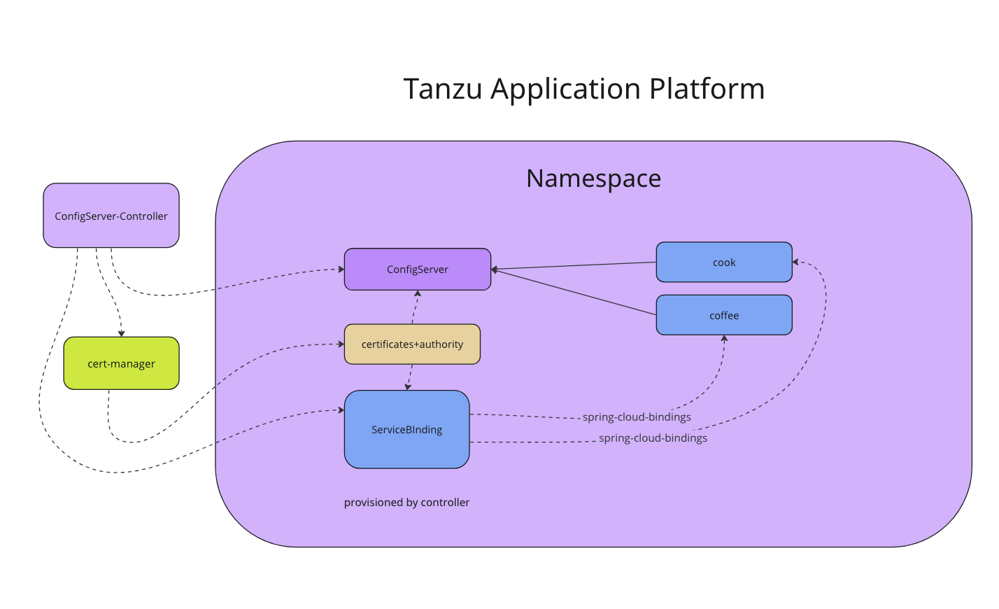

# Overview of Enterprise Config Server

Enterprise Config Server is an externalized configuration server based on the open-source Spring
Cloud Config project. Config Server provides a centralized server for delivering external configuration
properties to an application, and a central source for managing this configuration across deployment
environments.

For more detailed documentation, including client configuration setup, see the
[Spring Runtime - Config Server documentation](https://{{ vars.staging_toggle }}.vmware.com/en/VMware-Tanzu-Spring-Runtime---Config-Server/Commercial/Tanzu-Spring-Runtime/config-server-about-config-server.html).

##  Architecture

Workloads communicate with the `ConfigServer` resources in the application namespace. From within
Tanzu Application Platform, the Config controller communicates with the `ConfigServer` resources in
the application namespace.

##  Capacity requirements

Each node of the `ConfigServer` controller requires:

- 64 MiB of memory
- 10m of vCPU

with limits of:

- 128 MiB of memory
- 500m of vCPU

You can scale the controller horizontally for higher availability.
