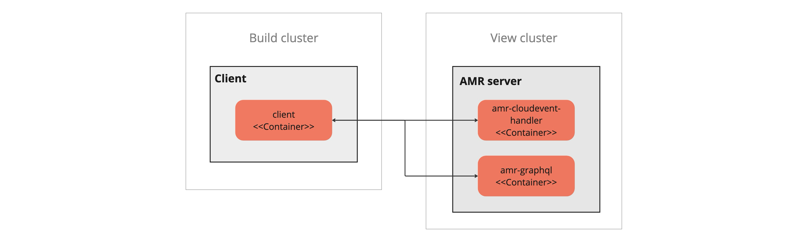
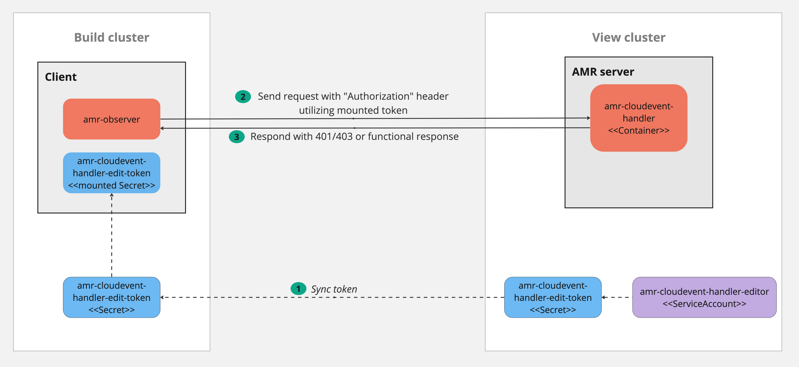

# Authentication and authorization

This topic tells you how to authenticate and authorize the Artifact Metadata Repository (AMR).

##  Overview

Authentication and authorization includes:

- [High-level design](#design)
- [Kubernetes service account automatic configuration](auth-k8s-sa-autoconfiguration.hbs.md)
- [Configuring a user-defined Kubernetes service account](auth-k8s-sa-user-defined.hbs.md)
- A CloudEvent user-defined service account
- Configuring AMR Observer with the CloudEvent Handler service account access token

##  High-level design

The AMR deploys the following Kubernetes services which expose HTTP endpoints:

- CloudEvent-handler
- GraphQL

Both CloudEvent-handler and GraphQL are in the same cluster. In a multicluster Tanzu Application
Platform deployment, they are in the View cluster and the clients can be from any cluster. This
topic shows the client in the build cluster in these examples.

The client sends requests to either service depending on their current task. `cloudevent-handler`
ingests events from the client and stores it in a database. The GraphQL server answers queries from
the client and returns data from the database.

Other than those points, `cloudevent-handler` and the GraphQL server are treated the same in this
design. They both use the same authentication and authorization solution. This topic simplifies the
explanation by only showing `cloudevent-handler`.

###  Kubernetes role-based access control (RBAC)

The server implements support for authentication by using Kubernetes RBAC. This includes requiring
the client to send a token from a Kubernetes service account token bound to a Kubernetes role.

1. The administrator creates a service account, `Role` or `ClusterRole`, and role binding in the
   cluster where `cloudevent-handler` is deployed in the View cluster. The role declares what
   permissions the client has:

   - For AMR Observer, the supported permissions are `update`, the resource `*`, and the group
     `cloudevents.amr.apps.tanzu.vmware.com`. No `resourceNames` are supported. That translates to
     “write for all resources” for the CloudEvents API.

   - For the GraphQL service, the supported permissions are `get`, the resource `*`, and the group
     `graphql.amr.apps.tanzu.vmware.com`. No `resourceNames` are supported. That translates to “read
     all” from the GraphQL API.

2. The administrator copies the service account token and puts it in the client cluster where the
   client container can read it. For example, the client can get the token mounted as a Kubernetes
   secret.
3. The client sends a request to AMR, and puts the service account token in the HTTP header
   `Authorization: Bearer <token>`.
4. `cloudevent-handler` reads the token and conducts a `TokenReview`.
5. `cloudevent-handler` does a `SubjectAccessReview` using the user information returned from
   `TokenReview` and the resource information as described earlier.
6. According to the Kubernetes RBAC system, `SubjectAccessReview` searches for any `Role` or
   `ClusterRole` associations by using bindings to find a match between the assigned roles to the
   specific service account and the requested resource information.

