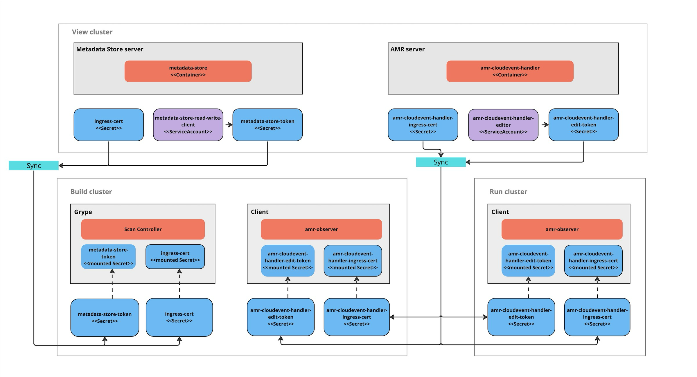

# Set up multicluster Artifact Metadata Repository (AMR)

This topic describes how you can configure Artifact Metadata Repository (AMR) in a multicluster setup.
This is necessary when installing multiple profiles such as View, Build, Run, and Iterate.

> **Note** This topic assumes that you are using SCST - Scan 2.0, as described in
> [Add testing and scanning to your application](../getting-started/add-test-and-security.hbs.md).
> If you are still using the deprecated SCST - Scan 1.0, you must follow the steps in this topic and
> the extra steps required for SCST - Scan 1.0 in [Set up multicluster for Scan 1.0](../scst-scan/multicluster-setup-scan-v1.hbs.md).

## <a id='overview'></a> Overview

After installing the View profile, but before installing the Build profile and Run profile, you must
copy some configurations from the View cluster to the Build and Run Kubernetes clusters. This
topic explains how to add these configurations, which allow components in the Build and Run clusters
to communicate with AMR in the View cluster.



## <a id='prereqs'></a> Before you begin

You must first
[install the View profile](../multicluster/installing-multicluster.hbs.md#install-view). This
installation automatically creates the CA certificates and tokens necessary to talk to the
CloudEvent Handler.

## <a id='summary'></a> Procedure summary

To deploy AMR in a multicluster setup:

1. [Copy the AMR CloudEvent Handler CA certificate from the View cluster](#copy-ceh-ca)
1. [Copy the AMR CloudEvent Handler edit token from the View cluster](#copy-ceh-token)
1. [Apply the AMR CloudEvent Handler CA certificate and edit token to the Build and Run clusters](#apply-ceh-ca-token)
1. [Install the Build and Run profiles](#install-build-run-profiles)

## <a id='copy-ceh-ca'></a> Copy the AMR CloudEvent Handler CA certificate data from the View cluster

With kubectl targeted at the View cluster, you can get the AMR CloudEvent Handler TLS CA
certificate's data by running:

```console
CEH_CA_CERT_DATA=$(kubectl get secret -n metadata-store amr-cloudevent-handler-ingress-cert -o json | jq -r ".data.\"ca.crt\"" | base64 -d)
```

## <a id='copy-ceh-token'></a> Copy the AMR CloudEvent Handler edit token from the View cluster

Copy the AMR CloudEvent Handler token into an environment variable by running:

```console
CEH_EDIT_TOKEN=$(kubectl get secrets amr-cloudevent-handler-edit-token -n metadata-store -o jsonpath="{.data.token}" | base64 -d)
```

You use this environment variable in the next step.

## <a id='apply-ceh-ca-token'></a> Apply the CloudEvent Handler CA certificate data and edit token to the Build and Run clusters

After you copy the certificate and tokens apply them to the Build and Run clusters before deploying
the profiles.

Build cluster:

- CloudEvent Handler CA certificate
- CloudEvent Handler edit token

Run cluster:

- CloudEvent Handler CA certificate
- CloudEvent Handler edit token

You can apply the CloudEvent Handler CA certificate and edit the token to the Build and Run clusters.
These values must be accessible during the Build and Run profile deployments.

1. Update kubectl to target the Build cluster.
1. If you already installed the Build cluster, skip to the next step. Otherwise, create a namespace
   for the CloudEvent Handler CA certificate and edit token by running:

   ```console
   kubectl create ns amr-observer-system
   ```

1. Update the Build profile `values.yaml` file to add the following snippet. The code configures the
   CA certificate and endpoint. In `amr.observer.cloudevent_handler.endpoint` you specify the
   location of the CloudEvent Handler that was deployed to the View cluster. In
   `amr.observer.ca_cert_data` you paste the content of `$CEH_CA_CERT_DATA`, which you copied
   earlier.

   ```console
   amr:
     observer:
       auth:
         kubernetes_service_accounts:
           enable: true
       cloudevent_handler:
         endpoint: https://amr-cloudevent-handler.<VIEW-CLUSTER-INGRESS-DOMAIN>
       ca_cert_data: |
           <CONTENTS OF $CEH_CA_CERT_DATA>
   ```

1. Create a secret to store the CloudEvent Handler edit token by running:

   ```console
   kubectl create secret generic amr-observer-edit-token \
     --from-literal=token=$CEH_EDIT_TOKEN -n amr-observer-system
   ```

   This command uses the `CEH_EDIT_TOKEN` environment variable.

1. Repeat the earlier steps, but configure kubectl to target the Run cluster instead of the Build
   cluster.

The Build and Run clusters now each have a CloudEvent Handler CA certificate and edit token named
`amr-observer-edit-token` in the namespaces `metadata-store-secrets` and `amr-observer-system`. Now
you are ready to deploy the Build and Run profiles.

## <a id='install-build-run-profiles'></a> Install the Build and Run profiles

If you came to this topic from
[Install multicluster Tanzu Application Platform profiles](../multicluster/installing-multicluster.hbs.md)
after installing the View profile, return to that topic to
[install the Build profile](../multicluster/installing-multicluster.hbs.md#install-build)
and [install the Run profile](../multicluster/installing-multicluster.hbs.md#install-run).

## <a id='resources'></a> Additional resources

- [Ingress support](ingress.hbs.md)
- [Custom certificate configuration](custom-cert.hbs.md)
