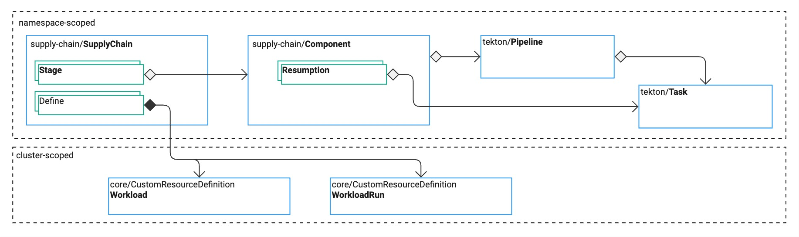

# Explanations for platform engineers

This topic tells you about the core architectural concepts of Tanzu Supply Chain. This topic focuses
on authoring a platform for application development.

{{> 'partials/supply-chain/beta-banner' }}

Tanzu Supply Chain enables platform engineers to author a seamless experience for development work
without expertise in Kubernetes.

##  About the primitives of Tanzu Supply Chain

Tanzu Supply Chain has the following primitives:

- `SupplyChain` defines the `Workload` kind and the components to use.
- `Workload` provides a developer API.
- `WorkloadRun` provides a record of each progression through a supply chain.
- `Component` provides an abstraction for a piece of work and reasons to trigger new runs.
- `Resumptions` provide a process for defining the triggering of new runs.

##  Overview of the Tanzu Supply Chain system

Each `SupplyChain` resource combines multiple `Component` resources in `stages`. `SupplyChain`
resources define a process for converting configuration workloads into final artifacts. They are
similar to pipelines in other CI/CD systems, but with some key differences:

- The `SupplyChain` defines a `Workload` custom resource definition (CRD), and the `Workload`
  becomes the interface that users, typically developers, consume to have work performed.

- Users are typically unaware of the inner workings of the `SupplyChain` and `Component` resources.

- `Component` resources encapsulate the work of generating a final or intermediate artifact and,
  importantly, the work of detecting new work to be performed.

The flow of operations is as follows:

1. Apply a valid `SupplyChain`, `Components`, and accompanying Tekton `Tasks` and `Pipelines`.

1. Tanzu Supply Chain generates a `Workload` CRD as defined by the `SupplyChain`.

1. A developer uses the Tanzu CLI to see the `Workload` kinds available to them.

1. The developer generates a `Workload` and fills in the required configuration.

1. Tanzu Supply Chain applies the `Workload`.

1. Tanzu Supply Chain starts the first `WorkloadRun`.

1. Tanzu Supply Chain captures the progress and artifacts of the first `WorkloadRun`.

1. Tanzu Supply Chain monitors `Component` resources that have `Resumptions` to detect if it must
   generate new runs. Tanzu Supply Chain generates new runs if:

   - There is new configuration in the `Workload`
   - There is new source code, base images, or other triggers from `Resumptions`

1. The developer observes the progress of runs using the Tanzu CLI.

##  Managing `SupplyChain` resources with GitOps

`SupplyChain` resources, such as the authoring resources `SupplyChain`, `Component`, Tekton
`Pipeline`, and Tekton `Task`, are delivered to clusters through a Git repository and GitOps source
promotion style.

For more information, see
[Manage SupplyChains with GitOps](../how-to/deploying-supply-chains/gitops-managed.hbs.md).

<!--
[SupplyChain]: ./supply-chains.hbs.md
[Workload]: ./workloads.hbs.md
[WorkloadRun]: ./workload-runs.hbs.md
[Components]: ./components.hbs.md
[Resumptions]: ./resumptions.hbs.md
[SecurityModel]: ./security-model.hbs.md
-->
