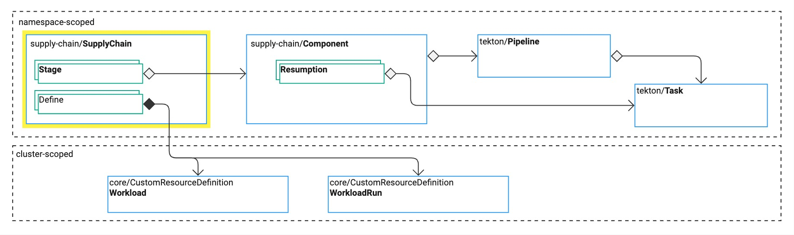

# Overview of SupplyChain

This topic tells you about the `SupplyChain` primitive in Tanzu Supply Chain. The `SupplyChain`
primitive unifies the Tanzu Supply Chain operation. For reference information, see
[SupplyChain](../../reference/api/supplychain.hbs.md).

{{> 'partials/supply-chain/beta-banner' }}

##  `SupplyChain` describes a process with stages

In physical manufacturing a supply chain is the process that delivers an end product to customers,
starting with the raw materials. In software, a supply chain delivers an operational end product to
customers, starting with source code. VMware refers to this as the golden path to production.

Tanzu Supply Chain provides a primitive called `SupplyChain`, which is a Kubernetes custom resource
that you use to define all, or portions of, your software supply chain.

This section describes typical uses of the `SupplyChain` primitive for Tanzu Supply Chain.

###  `SupplyChain` describes a build process

A `SupplyChain` primitive can describe the process of converting source code into a runnable or
deployable package.

Typical stages in this process are:

- Build:
  - Compile a binary from source.
  - Create an OCI image from the binary.
- Configure:
  - Create deployment artifacts, such as Kubernetes Pod definitions.
- Package:
  - Create packaging artifacts, such as a Carvel package or a Helm Chart.

##  `SupplyChain` defines a configuration resource

A `SupplyChain` primitive brings together the API for a user to apply to the cluster by:

- Defining a group and kind for a resource called a `Workload`. For reference information, see
  [spec.defines](../../reference/api/supplychain.hbs.md#specdefines).
- Specifying components used in the stages of the `SupplyChain`. For reference information, see
  [spec.stages[]](../../reference/api/supplychain.hbs.md#specstages).

By selecting components, `SupplyChain` aggregates each configuration for each component as a single
API specification for the `Workload`.

> **Note** `Workload` might be renamed in a later Tanzu Application Platform version.

###  `SupplyChain` enforces immutability

The version of your `SupplyChain` primitive that is embedded in the name must adhere to the rules
described in this section.

A patch update is required to update `SupplyChain` without an API change. The controller ensures
taht this rule cannot be broken when comparing `SupplyChain` primitives on the cluster.

For example, you can apply to a cluster:

- A `SupplyChain` primitive with the name `serverappv1s.example.com-1.0.0` and the kind `ServerAppV1s`
- A `SupplyChain` primitive with the name `serverappv1s.example.com-1.0.1` and the kind `ServerAppV1s`

If the generated API for the kind is unchanged, then the later version is accepted. If there is a
change, the `SupplyChain` primitive that was applied first succeeds, and the others reflect the
error in their statuses. This rule ensures that you cannot accidentally break the kind API that is
running.

These rules ensure that potentially thousands of `Workload` and `Run` resources on the cluster do
not break.

Recommended version practices:

- If the API and general behavior are unchanged by a change to the `spec.stages`:
  - Use a patch update, such as `1.2.5` to `1.2.6`
  - Keep the same kind, such as `ServerAppV1`
- If the API is unchanged, but something significantly different occurs because of changes to the
  `spec.stages`, consider doing:
  - An update to the minor or major version, such as `1.2.5` to `1.3.0`
  - An update to the kind, such as `ServerAppV2`
  - A change of kind, such as `ServerAppWithApprovalV1`
- If the API changes, consider doing:
  - An update to the minor or major version, such as `1.2.5` to `1.3.0`
  - An update to the kind, such as `ServerAppV2`

This ensures effective communication to your users. New kind versions typically indicate that the user
must migrate their resources to the new API.

##  Integrity validation

A `SupplyChain` primitive is not valid if:

- A required field is missing.
- The `Component` resources referenced are not in the same namespace.
- The `Component` resources referenced contain values that are not satisfied by their position in
  `spec.stages`.
- The name does not match the `spec.defines` section.
- `SupplyChain` breaks the versioning rules.

For more information, see [status.conditions[]](../../reference/api/supplychain.hbs.md#statusconditions).
