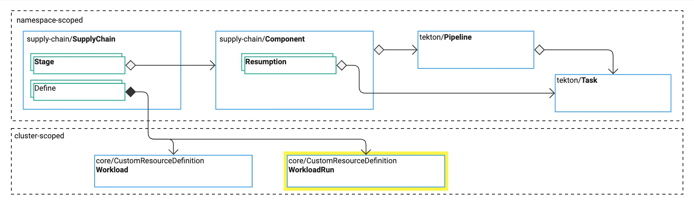

# Overview of WorkloadRun

This topic tells you about the `WorkloadRun` resource in Tanzu Supply Chain.
For reference information, see [WorkloadRun CRD](../../reference/api/workloadrun.hbs.md).

{{> 'partials/supply-chain/beta-banner' }}

The `SupplyChain` resource defines the `WorkloadRun` custom resource definition (CRD).
