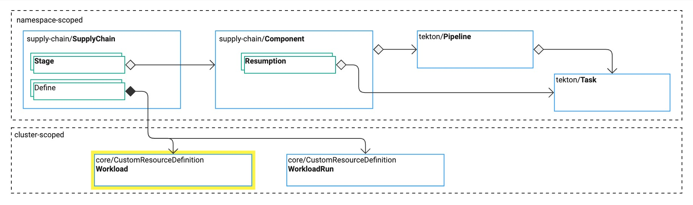

# Overview of Workloads

This topic tells you about the `Workload` resource in Tanzu Supply Chain.
For reference information, see [Workload CRD](../../reference/api/workload.hbs.md).

{{> 'partials/supply-chain/beta-banner' }}

The `SupplyChain` resource defines the `Workload` custom resource definition (CRD).
