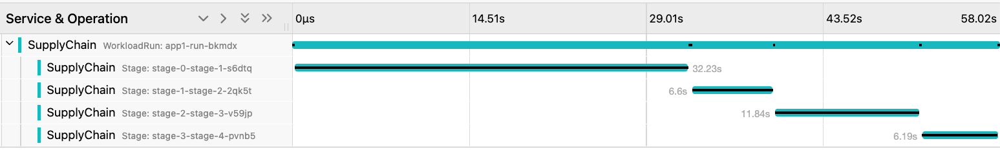

# Export telemetry data (experimental)

This topic tells you how to export Open Telemetry data and what information is currently exported.

> **Caution** This feature is experimental, and might change substantially as development continues.

Tanzu Supply Chain uses OpenTelemetry to export telemetry data. For a list of vendors and
observability tools that support OpenTelemetry, see the [OpenTelemetry](https://opentelemetry.io/)
website.

## <a id="config"></a> Configure a Supply Chain to export telemetry data

To export telemetry data to an OpenTelemetry collector, update the `tanzu_supply_chain` section of
`tap-values.yaml` to include the collector's address. For example:

```yaml
tanzu_supply_chain:
  ...
  open_telemetry:
    endpoint: "https://tempo.monitoring:4318"
    insecure: "false"
```

## <a id="info-about-exp-data"></a> Information about exported data

The supply chain exports `WorkloadRun` and `Stage` telemetry information:

- `WorkloadRun` information includes when a particular instance of a workload was triggered and its
  duration.
- `Stage` information includes when a workload was initiated, the workload duration, and which
  `WorkloadRun` instance the workload is associated with.

Telemetry data can be rendered in a visualizer. In the following visualizer example, the
`WorkloadRun` instance `app1-run-bkmdx` took roughly 58 seconds to finish and involved four stages.
Each `Stage` displays when it is triggered and its execution duration.



## <a id="known-limit"></a> Known limitation

Currently, `WorkloadRun` and `Stage` telemetry information are only published when they finish.
Therefore, `Stage` telemetry data can appear before the parent `WorkloadRun` telemetry data during a
run's execution. After the run finishes, all telemetry data associated with that run, including its
`Stages`, are published.
