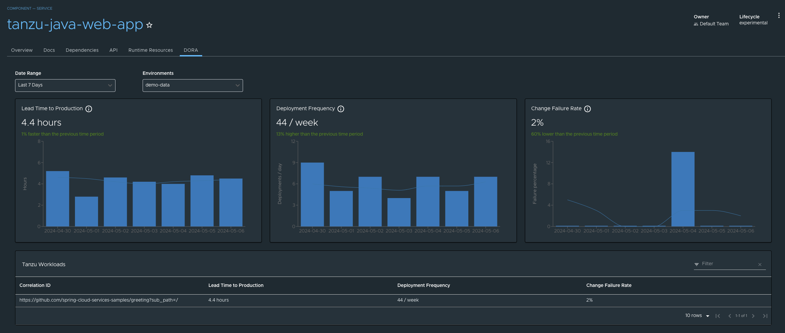

# DORA metrics in Tanzu Developer Portal

This topic tells you about viewing DevOps Research and Assessment (DORA) metrics in Tanzu Developer
Portal.

## <a id="overview"></a> Overview

DORA is a research program for studying the capabilities that drive software delivery and operations
performance. DORA helps teams apply these capabilities to improve organizational performance.
For more information about DORA, see the [DORA website](https://dora.dev/).

DORA metrics are a set of key performance indicators (KPIs) that DORA has developed to measure the
effectiveness of an organization's DevOps practices. These metrics help organizations to assess
their software development and delivery processes and identify areas for improvement.

Collecting DORA metrics can be challenging because it involves:

- Gathering data from various sources and tools
- Ensuring data accuracy and consistency
- Dealing with organizational and cultural resistance to measurement and improvement

Tanzu Application Platform is uniquely positioned to provide DORA metrics through its integrated
supply chain. This supply chain offers end-to-end visibility and control over the entire development
and deployment process, enabling comprehensive measurement and optimization of DevOps practices.

## <a id="dora-metrics"></a> DORA metrics

DORA metrics include:

- Deployment Frequency, which measures how often code changes are deployed to an environment. High
  deployment frequency is often associated with a mature DevOps culture.

- Lead Time for Changes, which measures the time it takes to go from code committed to code
  successfully running in an environment. Shortening this lead time is often a goal of DevOps
  practices.

- Change Failure Rate, which measures the rate at which changes to the production environment cause
  failures or incidents. Lower failure rates indicate a reliable software delivery process.

- Mean Time to Recovery (MTTR), which measures how quickly an organization can recover from
  incidents or outages in production. A lower MTTR suggests that an organization resolves issues
  quickly.

## <a id="supported-metrics"></a> Supported DORA metrics

This table shows supported DORA metrics in the Tanzu Application Platform v{{ vars.tap_version }}
DORA plug-in. Support for more metrics is planned for later DORA plug-in versions.

| DORA metric           | Tanzu Application Platform v{{ vars.tap_version }} DORA plug-in support |
|-----------------------|-------------------------------------------------------------------------|
| Deployment Frequency  | Yes                                                                     |
| Lead Time for Changes | Yes                                                                     |
| Change Failure Rate   | Yes                                                                     |
| Mean Time to Recovery | No                                                                      |

## <a id="use-dora-plug-in"></a> Viewing the DORA metrics for a component

To view the DORA metrics for a component:

1. Select the component you want to view DORA metrics for.

2. Click the **DORA** tab in the navigation list.



### <a id="dora-metric-filters"></a> Filtering options

By default, DORA metrics are calculated from the average number of deployments to all environments
in the last 7 days. Two filtering options are available from drop-down menus:

- By date range, based on a predefined set of choices
- By environment, based on the location labels configured by a platform engineer

For more information about location configuration, see
[Configure Artifact Metadata Repository](../../scst-store/amr/configuration.hbs.md).

There is an information tooltip for each metric that provides the user with a brief description of
that metric and how it is calculated. For more information about each calculation,
please see the [DORA metrics calculations](#dora-metrics-calc) section.

### <a id="dora-metric-graphs"></a> Historical graphs

DORA graphs display trends of each metric over time.

The Lead Time graph displays the average time taken for a code change to go from a
commit to a running container in daily bars. The trend line illustrates the average lead time for
deployments made in the last 7 days.

The Deployment Frequency graph displays the frequency of code changes deployed,
depicted in daily bars and a corresponding 7-day moving average trend line.

The Change Failure Rate graph displays the percentage of changes that failed to deploy successfully
in daily bars. The trend line illustrates the average failure rate for deployments made in the last
7 days.

Tanzu workloads have a correlation ID that groups all the artifacts together. The "out of the box"
(OOTB) supply chains automatically apply the `"apps.tanzu.vmware.com/correlationid"` annotation to
all Kubernetes resources created with the workload's correlation ID.

The default correlation ID is constructed from the source resource created from the workload. For
example, the correlation ID for a workload that defines its source as a Git repository might look
like `"https://github.com/<org>/<repo>?sub_path=<subPath>"`, where:

- `https://github.com/<org>/<repo>` is the URL of the Git respository containing the source code
  for the workload, and
- `<subPath>` is the path to the source code within the Git repository.

Application Operators can specify a custom correlation ID by setting the
`"apps.tanzu.vmware.com/correlationid"` annotation on the workload to the desired string. This
value will then be propagated to all resources created by the supply chain.

## <a id="dora-metric-calc"></a> DORA metrics calculations

For the Deployment Frequency metric, a deployment is considered to be the first time a pod is
scheduled for each distinct image built from a code change. The metric is displayed in terms of
deployments per week.

For the Lead Time metric, the lead time for a change is calculated as the period between when a
code change is made and the first time that a pod is scheduled for any image built from the change.
The metric is displayed in the largest time unit that results in a value of at least one.

For the Change Failure Rate metric, a failure is considered to have happened if 2 (or more) pod
terminations are detected for an image built from a code change within 10 minutes of the first
time that a pod was scheduled to run that image. The metric is displayed as a percentage of the
total number of deployments. Note that the minimum number of terminations and the period of time
during which terminations are included in the failure calculation are configurable by the
platform operator. See the [DORA metrics configuration](#dora-metrics-config) section for more
details.

## <a id="dora-metric-config"></a> DORA metrics configuration

The following is an example DORA metrics configuration, located under the dora key in the Tanzu
Application Platform values file:

```yaml
dora:
  changeFailureRate:
    terminationCount: 2
    terminationInterval: 10
```

Configuration options:

- `dora.changeFailureRate.terminationCount`
  - Default: 2
  - The minimum number of pod terminations detected for a given change to be considered to
    have failed to deploy successfully.

- `dora.changeFailureRate.terminationInterval`
  - Default: 10
  - The period in minutes during which time pod terminations are considered when determining if a
    change has failed to deploy successfully.
